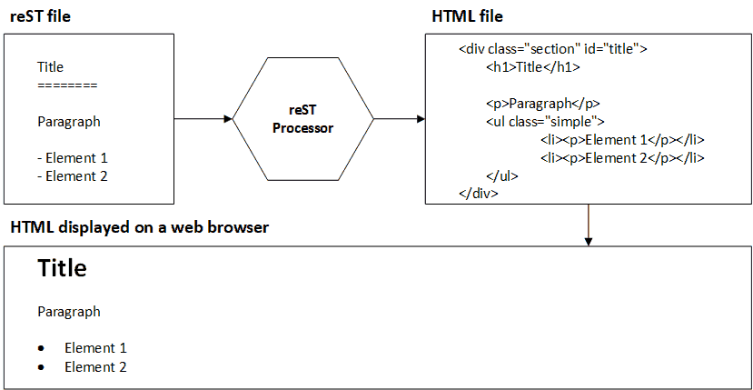
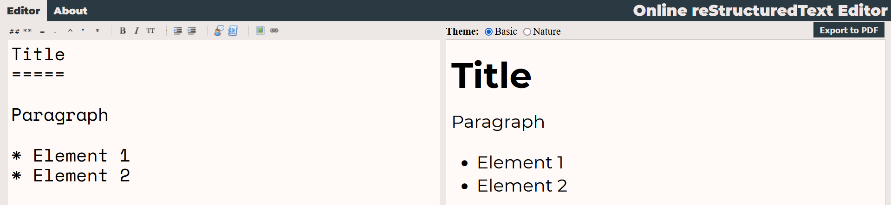

First Steps
===========

Before we get too specific, what is exactly *reStructuredText*? The answer comes in two halves. First, *reST* is a plain text lightweight markup language designed to be easy to read and write. Sure thing. For those not familiar with computer systems, what does all that mumbo jumbo mean?

*Plain text* means you can edit it in Notepad, in a text box in your browser, or even in Microsoft Word if you want. The point is that you don't need a particular software to modify it, it's just text. If you copy it from one place ato another, that's fine, because the text has no formatting that you can't see. As an example of this, here are two sentences:

1. The following text **is in bold**.
2. The following text \*\*is in bold\*\*.

The first sentence is not plain text because the bold text is already formatted. The second statement is plain text because it is not formatted (everything looks the same), and it is assumed that the reader or writer can infer that the stars (\*\*) are used to format the bold.

*Markup language* means that symbols are used to designate (or *mark*) features of the text. Going back to the bold text example, we can say that the text "is in bold" because it was marked with the symbols "\*\*".

*Lightweight* is a contrast performed against markup languages like HTML and XML. If you're not familiar with them, let's just say that they are very powerful languages, but also annoying and difficult to work with, at least when writing as we humans would. Here are two visual examples of the markup in reST and HTML:

	``HTML``: The following text <strong>is in bold</strong>.

	``reST``: The following text \*\*is in bold\*\*.

In this brief example, we can see that HTML uses eight characters for "<strong>" and nine for "</strong>", versus two for each \*\*. If we are talking about thirteen fewer characters in one simple sentence, imagine if you accumulate some characters here and there throughout an entire document.

So it's lightweight in two ways: it weighs fewer bytes for the computer because it has fewer symbols, and it's less tedious for us humans to type.

*Easy to read and write* comes from the above features. Without so many greater than and less than symbols, which are common in markup languages like HTML, it is more visually comfortable to read. Also, the symbols used (like \*\*) give a quick idea of the intended format of the text.

So far, so good. But how do we make some text enclosed by "\*\*" turn into bold text?

This is where the second half of the definition comes in: *reST* is a tool for converting the markup language to other useful formats.

Is it a language or a tool?
---------------------------

Let's be clear, *reST* is not pretty... but it has no need to be: *reST* was designed to be a fast middleman towards the final product (be it a PDF document or a webpage).

Therefore, the aim of *reStructuredText* is to be a practical language that allows us to write quickly and efficiently, and then provide us with a beutiful document to present.

And that is how we arrive at this duality: reST is both the tool that allows us to convert what we write into a more familiar format, as well as the definition of the meaning of the symbols that will later be converted. This can be seen in `figure 2.1`_.

.. _figure 2.1:

	Figure 2.1: Diagram of the reST compilation process.

That is, `figure 2.1`_ shows the role of *reStructuredText* in these four steps:

1. A file with the extension *rst* is created, containing plain text marked up thanks to the *reStructuredText* syntax.
#. Our file goes through a *reST* processor, which is a program to translate the plain text with markup into another format. Throughout this book we'll assume the output format is HTML.
#. We have a file in HTML thanks to the processor, although that format is not very friendly to human eyes in its plain text form.
#. We view the HTML in a browser (like Firefox or Chrome), and everyone is happy.

This is starting to sound complicated, I know. How do we work with *reST* if we need so many parts?

Online Editor
-------------

The diagram in `figure 2.1`_ boils down to one action: using an `online editor`_. In `figure 2.2`_ you can see two of the elements:

#. The *reST* code on the left side.
#. The final product in HTML, on the right side.

.. _figure 2.2:

	Figure 2.2: *reST* editor online.

Behind the scenes, on large servers, runs the *reST* processor, and your browser takes care of displaying the HTML properly. So we can conclude that the above explanation was just a cultural addition (you're welcome), but from now on just use the editor at `https://rst-editor.ramoscarlos.com/ <https://rst-editor.ramoscarlos.com/>`_.

If you want to follow the examples presented throughout the book, you will need a computer with an Internet connection (don't worry, we will only use the `online editor`_ described above).

Markdown Comparison
-------------------

Markdown and reStructuredText belong to the same family: both are lightweight markup languages. Their goal is to keep us from leaving the keyboard to click on some icons to set the style, and to make the entire document readable and fast to write.

Markdown, as reST, is a format as well as a tool to translate to HTML. It is the most popular sibling, the most widely used markup language, and it has been implemented across many applications and sites. You can use it on programming sites like GitHub and Bitbucket, and there are also extensions to add it to email clients, and frameworks for creating websites like Jekyll_.

The Markdown ecosystem is vast, and its implementations are numerous... and that's how we arrive to one of the problems with Markdown. It turns out that John Gruber created Markdown as a tool to convert text to HTML with web writers in mind. The invention caused a stir and many people began to adapt it to their needs. In the blink of an eye, there were plenty versions of Markdown. At least, enough to make the masses dizzy.

In an attempt to unify all the version that popped out of nowhere, the CommonMark_ language was created as a common base, although there are still wild variants. For example, GitHub has its own variant (in colloquial language, *flavor*), called `GitHub Flavored Markdown`_ (GFM), which among other things adds source code syntax highlighting.

One of the most annoying things about so much diversity is the handling of whitespace. While for some flavors a line break in markup means a line break in HTML, for others it means staying in the same paragraph, and two spaces at the end of each line indicate a line break in HTML. A slight annoyance, no doubt, that one can adapt to.

Another problem with Markdown is that it was conceived to deal with a single document. MultiMarkdown_ (MMD), another widely used version, added the ability to include a document within another, because even the GitHub variant does not allow this. In addition, MMD can compile to more formats, such as HTML and PDF (a capability reST has by).

So... if the Markdown variants are no longer a problem, and there is a variant that abides by the DRY principle, why would we choose a less popular markup language? To give the answer, we need to talk about another tool.

reStructuredText and Sphinx
---------------------------

If you've lost your bearings with the history of Markdown and its thousand and one flavors, imagine having to explain all that to your boss while trying to convince him that all that technological mess is the most appropriate choice for a documentation system. This is where we can mention some features of reStructuredText:

+ While Markdown was created to deal with one file at a time, reStructuredText makes use of the ``include`` directive to merge several files.
+ While Markdown did not contemplate source code (already added by GFM), reST has the ``code`` directive and many syntaxes.
+ While Markdown was a converter with few instructions, reST was designed as an extensible language.

And it is in that last word, *extensibility*, where the difference lies. That ability to be extended is what gave rise to Sphinx, a complete system for documenting a software project, capable of generating a searchable website, as well as having a converter to PDF and other formats. Yes, all in one package, without so much history.

This is not to say that Sphinx and reST are superior to Markdown and its variants, since we are at a point where both markup languages are capable of doing the same thing. I am mentioning the different ways they got there: Markdown evolved little by little, through variants, and reST was designed to be extensible, born to document software.

One drawback Sphinx has is that it needs the user to have Python installed locally, as that is used to download Sphinx and its dependencies. For this reason, although Sphinx is the reST processor of choice in most cases, we will only use the online editor.

Are we programming?
-------------------

Throughout this book I use expressions that include "source code" or "language", perhaps I'll even say something about "programming". However, using the reST syntax does not imply programming. Yes, it has directives, a very specific syntax, it yields unexpected results if you don't put the directive names right, and even if blank spaces are not where they should be... but no.

We are not programming, in any way. So why do I say "source code"? Maybe it's out of habit. In programming, "source code" is what the human writes, so that the computer can then translate it. In a certain sense, our reST document is what we write, to then convert it to HTML. Perhaps "source text" is more appropriate... but it is a language created by programmers, and habits are hard to eradicate.

Don't be fazed if you see those terms throughout this manuscript. I'm only referring to what we write in reST format.

Summary
-------

In this chapter we learned that reST is both a markup language and a translation tool to other formats, and that we can use it thanks to an `online editor`_.

We also compared it a bit to Markdown, concluding that you can do the same thing with both languages, although for documenting a project reST may be better, since it was designed for that.

Finally, we talked about Sphinx, a tool that is like reST on steroids, but that we will not use here because it requires local installation.

.. _online editor: https://rst-editor.ramoscarlos.com/
.. _Jekyll: https://jekyllrb.com/
.. _CommonMark: https://commonmark.org/
.. _GitHub Flavored Markdown: https://github.github.com/gfm/
.. _MultiMarkdown: https://fletcherpenney.net/multimarkdown/

